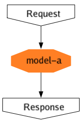

# seldon-core-visualize

Use to turn `Inference Graph` in `SeldonDeployment` which is defined by [SeldonCore](https://github.com/SeldonIO/seldon-core) into flowchart image

## Example

Turn [seldondeployment.yml](example/seldondeployment.yml) into 

## Start Project

- Check usage

```shell
go run main.go -h
```

- Execute transformation

```shell
go run main.go -o flowchart.png path/to/sdep.yml
```

## Build Project

- Native platform

```shell
go build main.go
```

- Cross platform
  - **Can not disable `CGO`**
  - Use `macOS` to `Windows` as example
    - Precondition: `brew install mingw-w64`

```shell
CGO_ENABLED=1 GOOS=windows GOARCH=amd64 CC=x86_64-w64-mingw32-gcc CXX=x86_64-w64-mingw32-g++ go build -o main.exe main.go
```
